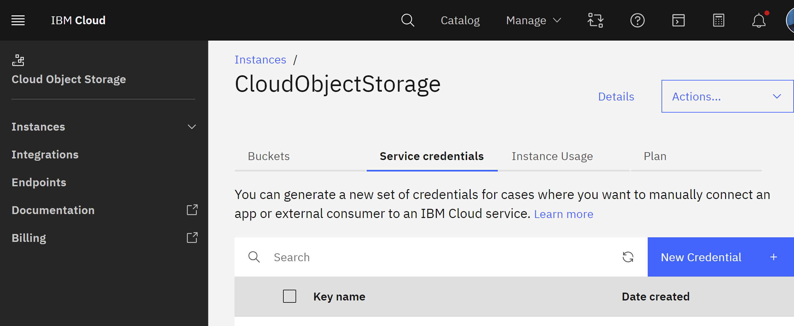
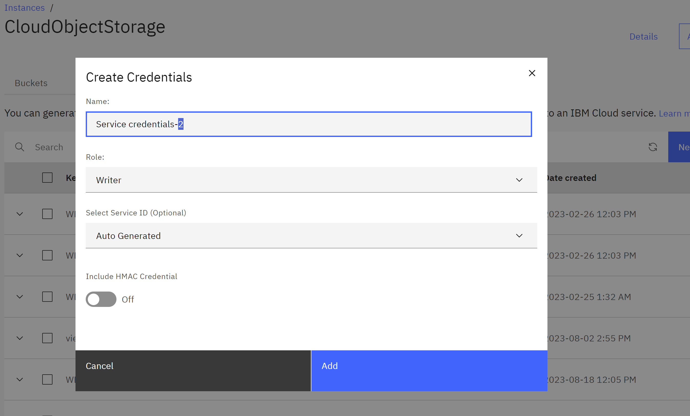
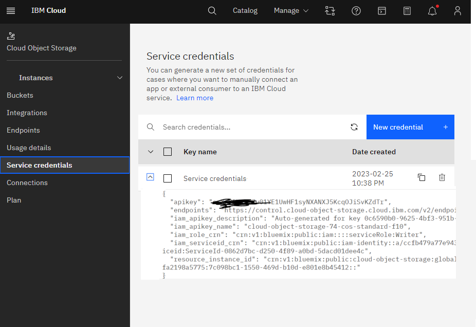
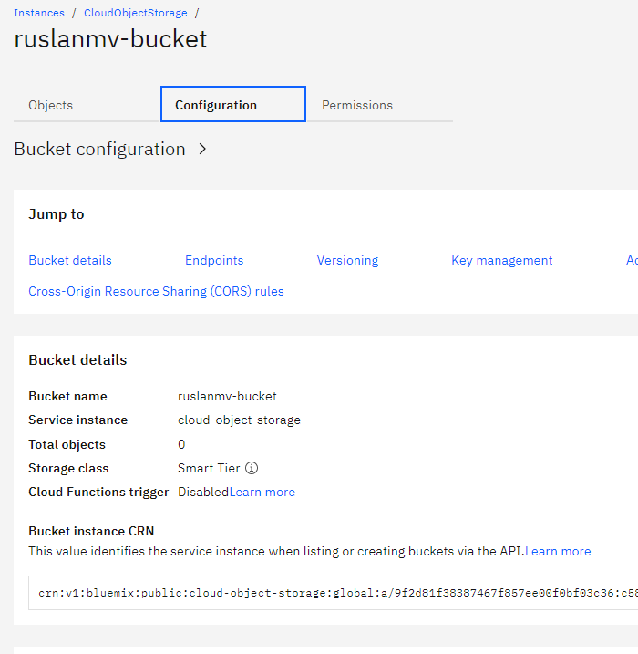
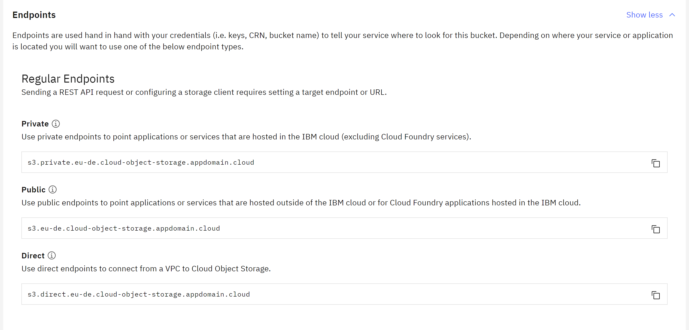

**Setup IBM Cloud Account**
To get all the API keys and information needed to interact with IBM Cloud Object Storage, follow these steps:
1. Create an IBM Cloud account: If you don't have an IBM Cloud account yet, sign up for a free account at  [https://cloud.ibm.com/registration](https://cloud.ibm.com/registration).
2. Create an instance of the Cloud Object Storage service:
   a. Log in to your IBM Cloud account.
   b. Go to the Catalog by clicking on "Catalog" in the top navigation menu.
   c. Search for "Object Storage" and click on the "Object Storage" service.
   d. Fill in the required information, such as the service name and resource group, and click "Create" to create an instance of the Cloud Object Storage service.
3. Create a bucket in your Cloud Object Storage instance:
   a. From the IBM Cloud dashboard, click on your Cloud Object Storage service instance.
   b. Click the "Buckets" tab and then click the "Create bucket" button.
    Click customize your bucket
   c. Fill in the required information, such as the bucket name, location, and storage class, and click "Create" to create a new bucket.
   In this demo I will use the bucket `ruslanmv-bucket` for Cloud Object Storage.

4. Go to Service Crdentials and create new credentials.

and we give a name `Service Credentials`  for exaple select role `writter`

and we copy the data

For endpoint_url you have to select configuration under bucket and copy the public URL

you should choose appropate edpoints, if you are working in a public bucket you should use the public endpoint but if you are inside the IBM cloud you should change to private. 

